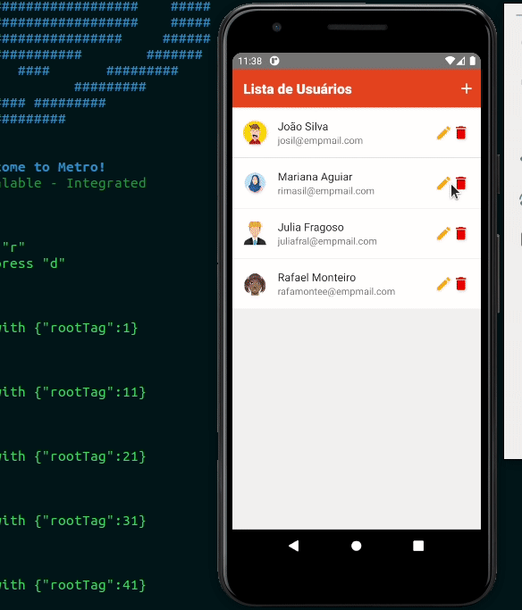
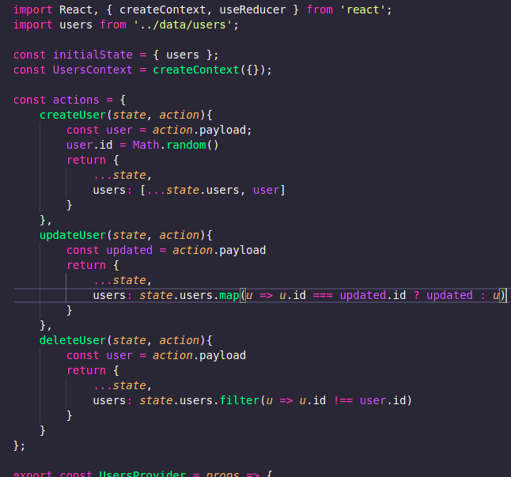

<<<<<<< HEAD
# RNCRUD

> This is a small project made with the sole objective of study React-Native and Redux.

This project is a mocked list of users. The purpose of this list is to simulate a registration environment. That way we can work on this simulation: adding new members, removing or editing exisiting registrations.




The project has an interface in portuguese, however, the code language is English (How you can see in the image below).



## Installation

>After downloading the project you must execute command:

If you use Yarn:
```sh
yarn install
```
if you use npm:

```sh
npm install
```


## Meta

Júnior Nunes - [@Júnior-Nunes](https://www.linkedin.com/in/j%C3%BAnior-nunes-35a525170/) - denisonprobable13@gmail.com

[https://github.com/jnunes-ds/rncrud.git](https://github.com/jnunes-ds)
